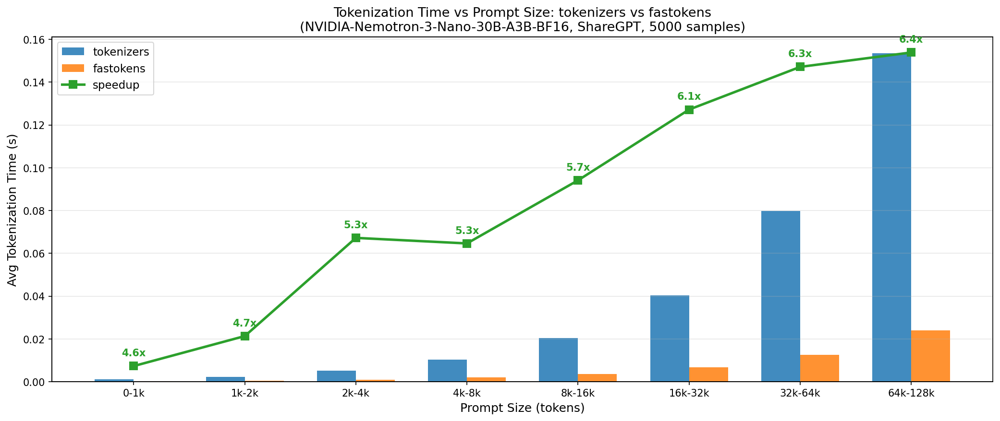
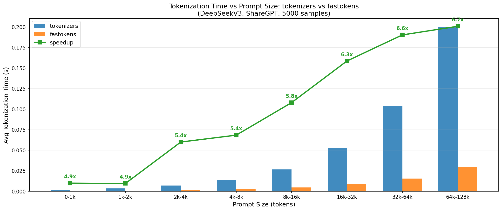
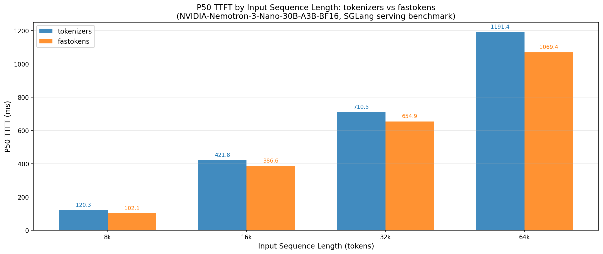

# ⚡ fastokens

fastokens is a fast [BPE](https://en.wikipedia.org/wiki/Byte_pair_encoding) tokenizer for use with
popular open-weight LLMs, built on top of a high-performance Rust backend.

`fastokens` can be installed from source:
```
git clone https://github.com/atero-ai/fast-tokens
uv pip install fast-tokens/python
```

The Python API lives in the `python` directory. To use `fastokens` as a drop-in replacement with
[transformers](https://github.com/huggingface/transformers), see the
[patching example](#using-with-transformers) below.


## Performance

`fastokens` on average achieves a 10x+ faster tokenization compared to the `tokenizers` library.
The gap widens as prompt sizes scale, as shown in the graphs below.





Faster tokenization directly impacts live workloads. Tested using SGLang's benchmark suite, `fastokens` reduces time-to-first-token (TTFT) across prompt sizes:



Note that `fastokens` is focused on inference and does not support all features of `tokenizers`.
In particular, additional encoding outputs, and some normalizers/pretokenizers are not available.

## Tested models

The following models have been tested, but `fastokens` should generally work with most BPE tokenizers supported by the `transformers` library:

- `nvidia/NVIDIA-Nemotron-3-Nano-30B-A3B-BF16`
- `openai/gpt-oss-120b`
- `deepseek-ai/DeepSeek-V3.2`
- `deepseek-ai/DeepSeek-V3`
- `deepseek-ai/DeepSeek-R1`
- `Qwen/Qwen3-Next-80B-A3B-Thinking`
- `Qwen/Qwen3-Next-80B-A3B-Instruct`
- `Qwen/Qwen3-235B-A22B-Instruct-2507`
- `Qwen/Qwen3.5-397B-A17B`
- `MiniMaxAI/MiniMax-M2.1`
- `MiniMaxAI/MiniMax-M2.5`
- `mistralai/Devstral-Small-2-24B-Instruct-2512`
- `zai-org/GLM-4.7`
- `zai-org/GLM-5`


## Usage

### Using with transformers

Note that it currently works with transformers 4.57.1 (the version used by current sglang).

```python
import fastokens
fastokens.patch_transformers()

from transformers import AutoTokenizer
tokenizer = AutoTokenizer.from_pretrained("nvidia/NVIDIA-Nemotron-3-Nano-30B-A3B-BF16")
tokens = tokenizer("Hello, world!")
assert tokens["input_ids"] == [22177, 1044, 4304, 1033]
```

### Standalone usage

```python
from fastokens._native import Tokenizer
tokenizer = Tokenizer.from_model("deepseek-ai/DeepSeek-V3.2")
tokens = tokenizer.encode("A very long prompt that is now lightning fast.")
```
